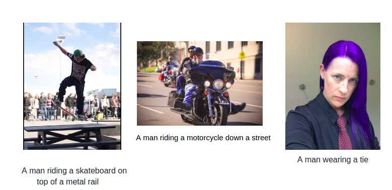

# Image-Captioning

Working on the analysis of state of the art Image Captioning Models using a pretrained VGG-19 Model on the MSCOCO Dataset.

## Requirements

* Tensorflow
* MSCOCO Dataset (can be downloaded from http://mscoco.org/dataset/)
* pycocotools (clone from https://github.com/pdollar/coco)
* PIL

## Processing Image

The images can be of varying dimensions. To use the pretrained VGG-19 net we need to reshape the image to the input to the input shape of VGG net (224x224x3). 
For this, we reshape while maintaining the aspect ratio of images. (Padding image if necessary)
Use the following for saving the processed image in the required directory.
``` bash 
python image_process.py open_path='<source_directory>' save_path='<destination_directory>'
```
After the script finishes, you will get the processed images in the destination directory with the same name as images in source directory.
Both open_path and save_path fields are compulsary.

## Processing Captions
The text-process.py code is customised for the mscoco caption format. You are free to make changes to the code if you want to train the model on other datasets. 
### Processing Captions for MSCOCO
The pycocotool assigns a caption id to each caption and each image has 5 captions. The text-process.py processes the captions by making a vocabulary (the size of the vocabulary can be changed using the vocab_size variable in the code  and stores vocabulary and the processed captions in the form of index tokens. The processed captions file stores a dictionary of the following form: {caption_id : [list of index tokens of the caption]}
``` bash 
python text-process.py --annFile="<argument_1>" --save_path="<argument_2>" --make_vocabulary="<argument_3>" --vocab_path="<argument_4>" 
```
* *argument_1* : The full address of the JSON format caption file of captions ( Can be downloaded from annotation section of http://mscoco.org/dataset/#download) 
* *argument_2* : The directory path where you want to store the pkl file of processed captions. The name of the saved file will be **Processed_Captions.pkl**
* *argument_3* : True if you want to make the vocabulary again. If already made the vocabulary once, then set this flag to False.
* *argument_4* : If argument_3 = True, then it is the path where you want to store the newly built vocabulary. It will be saved by the name **Vocabulary.pkl**. If argument_4 = False, it is the path from where you want to access the vocabulary. 

## Training the model

The model used for training model/image_captioning_model.py uses the pretrained VGG-net which is trainable through the vgg_train flag. It uses a LSTM decoder for caption generation. The configuration of the network can be changed from the config/config.py file. For running the model use the following command. (An example command has been give in script.sh).
``` bash 
python train_hybrid.py --save_path="<save-path>" --log_path="<log-path>"
```
## Sampling from the trained model

The model when trained can be used for inference. The image you want to sample from can be given in the sampler.py (I am using a random validation set image for demo). The output of the sampler.py is the final caption generated by the model. 
``` bash
python sampler.py --log_path="<log-path>"
```
## Results

<p align="center">

</p>


